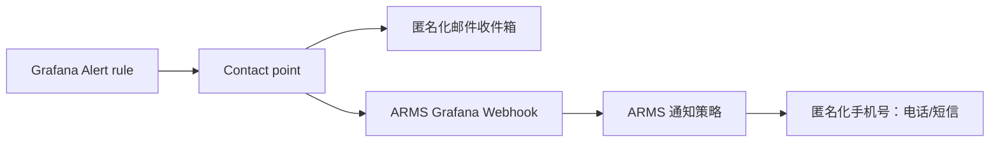

# Doris App：Grafana 告警推送到手机与邮件

本文记录一套已在 Grafana 中启用的 Doris 告警流程：Grafana 执行 Doris SQL，满足条件后同时发送邮件，并通过阿里云 ARMS 转发电话和短信。

> 安全说明：本文中的邮箱、手机号和 Webhook 均已匿名化。不要把 ARMS Webhook 地址、Token 或完整个人联系方式写入文档、截图或代码仓库。

## 已配置结果

| 项目 | 配置 |
| --- | --- |
| Grafana Contact point | `grafana-default-email` |
| 邮件收件人 | `h***@gmail.com`（已匿名化） |
| 手机通知 | 已验证手机号 `1********35`（已匿名化），由 ARMS 发送电话/短信 |
| ARMS 集成 | Grafana Webhook，地址未在本文展示 |
| 规则评估组 | `Doris Health Checks`，每 1 分钟执行一次 |
| 当前状态 | 两条规则均为 `Normal` |



## 1. 配置通知渠道

在 Grafana 打开 **Alerting → Contact points**，编辑默认 Contact point：

1. 保留 **Email** 集成，填写实际收件邮箱。
2. 点击 **Add contact point integration**，添加 **Webhook**。
3. 将 ARMS 的 Grafana 集成地址填入 Webhook URL；该地址属于敏感凭据，不应复制到文档。
4. 保存 Contact point。

截图中只展示了 Email 与 Webhook 两个集成，不包含邮箱地址和 Webhook 值。


在 ARMS 中还需完成以下事项：

1. 开通智能告警、短信与电话服务。
2. 新建并验证通知对象的手机号码。
3. 创建通知策略，匹配 Grafana 来源（`_aliyun_arms_product_type = Grafana`）。
4. 为该策略启用电话和短信；需要由 ARMS 投递邮件时，也可额外启用邮箱。

## 2. Doris 数据源连通性兜底规则

规则名称：`Doris 数据源连通性异常`

查询：

```sql
SELECT 1 AS value
```

规则逻辑：

- 正常返回 `1` 时不告警（阈值设为大于 `2`）。
- 查询超时、执行错误或无数据时，将规则状态设为 `Alerting`。
- 每分钟评估一次。

这条规则用于发现 Grafana 到 Doris 的查询链路异常；它是兜底健康检查，并不用于识别业务慢查询。

## 3. Doris 慢查询规则

规则名称：`Doris 慢查询`

查询：

```sql
SELECT COUNT(*) AS value
FROM information_schema.processlist
WHERE TIME > 60
  AND COMMAND <> 'Sleep'
```

规则逻辑：

- 查询统计当前运行超过 60 秒、且非空闲的 SQL 数量。
- 阈值为 **Is above 0**：发现任意一条慢查询即告警。
- 每分钟评估一次，Pending period 设为 **None**。
- 因为按分钟轮询，实际告警发生在查询运行约 60–120 秒之间。
- 查询执行错误或超时时也进入 `Alerting`，避免监控规则本身失效却无感知。

> 当前验证结果为 `0`，因此规则处于 Normal。此规则只检测“当前仍在运行”的慢查询；已经执行结束的历史慢查询需要依赖审计日志或慢日志表另建规则。

## 4. 通知与验证

两条规则均直接选择 `grafana-default-email` Contact point，因此每次 Firing 都会：

1. 发送邮件至已配置的匿名化收件箱。
2. 调用 ARMS Webhook。
3. 由 ARMS 通知策略发送短信和电话。

保存后，在 **Alerting → Alert rules** 中可看到两条规则均为 Normal：


建议在低风险时段用一条可控的、运行超过 60 秒的测试 SQL 验证端到端告警；测试会实际发送邮件、短信和电话，完成后应立即停止该测试 SQL。

## 后续优化建议

- 将 60 秒阈值按业务 SLA 调整，例如报表任务可设为 5 分钟。
- 如果需要识别历史慢查询，将 Doris 审计日志写入可查询表，并按时间窗口统计慢查询次数。
- 给规则增加 `severity`、`service=doris`、`environment` 等标签，后续可通过 Notification policies 做分级路由。
- 将稳定后的规则和 Contact point 导出为 provisioning 或 Terraform，避免仅依赖 UI 手工配置。
