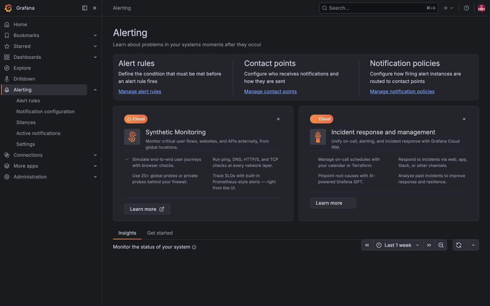
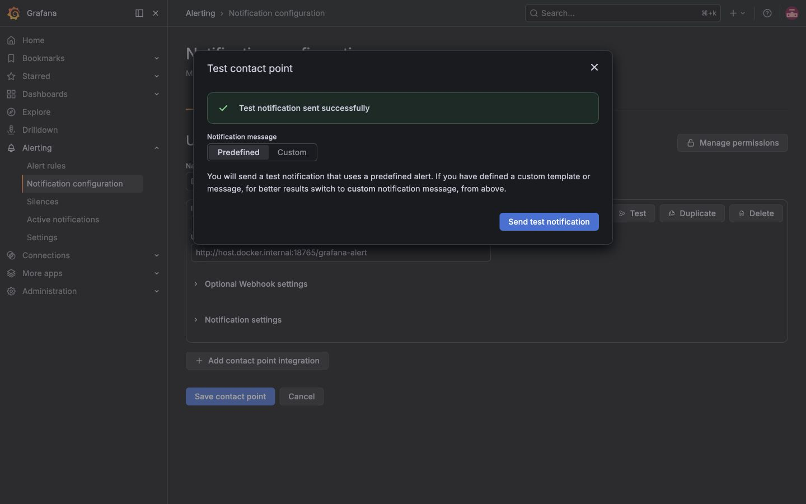
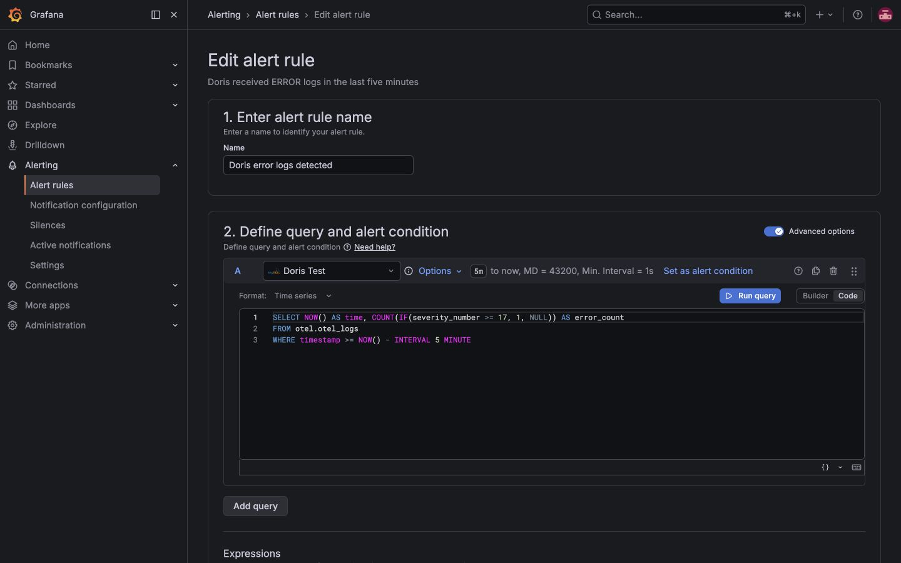
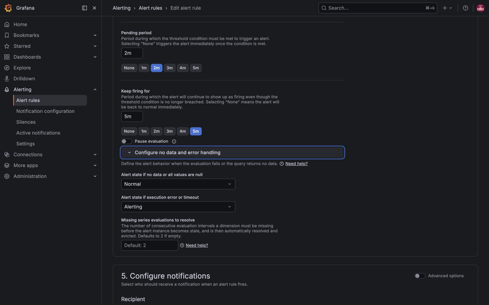
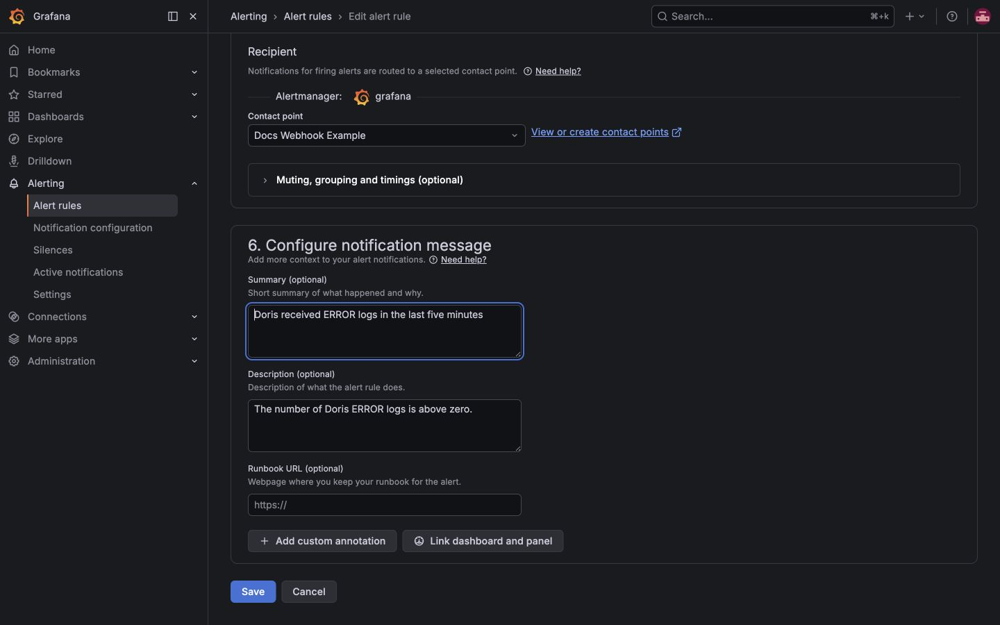
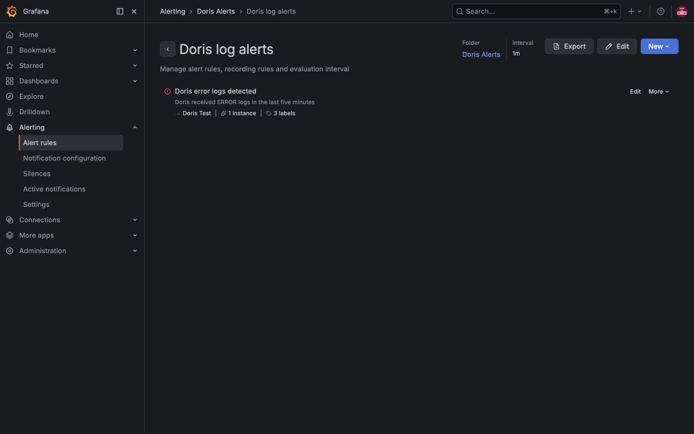

# 使用 Doris 数据源配置 Grafana Alert

本文介绍如何在 Grafana 13.1 中使用 Doris/MySQL 数据源创建日志告警，并通过 Webhook 接收通知。示例规则会在最近 5 分钟出现 `ERROR` 日志时触发。

> 本文中的 Alert 由 Grafana Server 在后台执行，不依赖 Doris App Plugin 的页面逻辑。即使用户关闭浏览器或停用 App Plugin，只要 Grafana、Doris 数据源和告警规则仍然可用，规则就会继续评估。

## 前置条件

开始前请确认：

-   Grafana Unified Alerting 已启用。
-   当前用户拥有 Editor、Organization Admin 或对应的 Alerting 写权限。
-   Grafana 中已经配置可用的 Doris/MySQL 数据源。本文使用 `Doris Test`。
-   数据源账号对目标表拥有查询权限。生产环境应使用 Doris 只读账号，不要使用 `root`。
-   日志表至少包含时间、严重级别等可用于计算告警条件的字段。本文使用 `otel.otel_logs`。
-   Grafana 数据源时区与 Doris 写入时间一致，否则“最近 5 分钟”可能查不到刚写入的数据。

可以先在 **Connections → Data sources → Doris Test** 中执行 **Save & test**，或者在 Explore 中运行一条只读查询，确认数据源连接正常。

## 配置流程概览

打开左侧菜单中的 **Alerting**。Grafana Alerting 主要包含：

-   **Alert rules**：定义查询、阈值和评估周期。
-   **Contact points**：定义通知接收方，例如 Webhook、邮件或企业微信。
-   **Notification policies**：根据标签路由、分组和静默通知。



本文使用规则直接选择 Contact Point 的方式完成最小可用配置。需要按团队、环境或严重级别统一路由时，再使用 Notification policies。

## 1. 创建 Webhook Contact Point

1. 打开 **Alerting → Notification configuration → Contact points**。
2. 点击 **New contact point**。
3. 在 **Name** 中输入易于识别的名称，例如 `Doris Alerts Webhook`。
4. 在 **Integration** 中选择 **Webhook**。
5. 在 **URL** 中填写实际告警接收地址。
6. 点击 **Test → Send test notification**。
7. 确认页面显示 **Test notification sent successfully**，然后保存 Contact Point。



截图中的地址只用于本地文档测试。请替换为真实的告警网关、企业微信、钉钉或内部 Webhook 地址，不要把 Token、签名密钥等凭据写入文档或截图。

## 2. 创建 Doris 日志告警

打开 **Alerting → Alert rules**，点击 **New alert rule**。

### 设置名称、查询和触发条件

规则名称填写 `Doris error logs detected`，数据源选择 `Doris Test`，将查询编辑器切换到 **Code**，并将 **Format** 设置为 **Time series**。

输入以下 SQL：

```sql
SELECT
  NOW() AS time,
  COUNT(IF(severity_number >= 17, 1, NULL)) AS error_count
FROM otel.otel_logs
WHERE timestamp >= NOW() - INTERVAL 5 MINUTE
```

这条查询始终返回一个时间点和一个数字值：

-   `time` 是 Grafana Time series 所需的时间列。
-   `error_count` 是最近 5 分钟内 `severity_number >= 17` 的日志数量。
-   即使没有 ERROR 日志，`COUNT` 也会返回 `0`，避免把“没有错误”误判为 No data。

然后配置表达式：

1. **B — Reduce**：Input 选择 `A`，Function 选择 `Last`。
2. **C — Threshold**：Input 选择 `B`，条件设置为 **Is above 0**。
3. 确认 `C` 标记为 **Alert condition**。
4. 点击 **Preview**，确认查询和表达式没有错误。



> Grafana 告警在服务端执行，不能依赖 Dashboard 模板变量。需要监控不同环境或服务时，可以直接在 SQL 中增加固定过滤条件，或让查询返回字符串标签列以创建多维告警。

### 设置 Folder、Labels 和评估行为

将规则放入一个专用 Folder，例如 `Doris Alerts`，并添加以下 Labels：

| Label      | Value           | 用途         |
| ---------- | --------------- | ------------ |
| `team`     | `observability` | 标识负责团队 |
| `service`  | `doris`         | 标识服务     |
| `severity` | `warning`       | 标识告警级别 |

设置评估行为：

-   **Evaluation group**：`Doris log alerts`
-   **Evaluation interval**：`1m`
-   **Pending period**：`2m`
-   **Keep firing for**：`5m`
-   **Alert state if no data or all values are null**：`Normal`
-   **Alert state if execution error or timeout**：`Alerting`



这些设置表示：条件连续满足 2 分钟后才进入 Firing，减少瞬时错误造成的噪声；条件恢复后仍保持 5 分钟 Recovering，避免状态频繁抖动。Doris 不可连接或 SQL 超时时按 Alerting 处理，以便暴露监控链路故障。

## 3. 配置通知和告警内容

在 **Configure notifications** 中直接选择前面创建的 Contact Point，例如 `Doris Alerts Webhook`。

填写通知内容：

-   **Summary**：`Doris received ERROR logs in the last five minutes`
-   **Description**：`The number of Doris ERROR logs is above zero.`
-   **Runbook URL**：如有排障手册，填写可访问的 HTTPS 地址。



点击 **Save**。保存后返回 Alert rules 列表，检查规则的 **State** 和 **Health**：

-   **Normal**：条件未满足。
-   **Pending**：条件已满足，但尚未达到 Pending period。
-   **Firing**：条件持续满足，通知开始发送。
-   **Recovering**：条件已恢复，但仍处于 Keep firing for 窗口。
-   **Error**：数据源查询或表达式执行失败。



## 验证告警

上线前至少完成以下验证：

1. Contact Point 的测试通知成功到达接收端。
2. 点击规则中的 **Preview**，确认 `A` 返回 Time series，`B` 返回最后一个数值，`C` 正确判断阈值。
3. 写入一条符合条件的测试日志，确认规则依次进入 Pending 和 Firing。
4. 等待测试日志移出 5 分钟窗口，确认规则进入 Recovering，随后恢复为 Normal。
5. 暂时使用错误的数据源地址或在隔离环境停止 Doris，确认 Execution error 会进入 Alerting；验证后立即恢复配置。

不要在生产环境通过写入虚假错误或停止 Doris 来测试告警。生产验证应使用隔离数据、专用测试规则或维护窗口。

## 常见问题

### Preview 显示 No data

-   确认查询格式是 **Time series**，不是 Table。
-   查询必须返回名为 `time` 的时间列和至少一个数值列。
-   检查 Grafana 数据源时区、Doris Session 时区和日志写入时间是否一致。
-   在 Explore 中执行相同 SQL，确认时间过滤范围内确实存在数据。
-   不要在告警 SQL 中使用 Dashboard 模板变量。

### Preview 或规则状态显示 Error

-   在 **Connections → Data sources** 中重新执行 **Save & test**。
-   检查 Doris FE 地址、MySQL 查询端口、账号权限和网络连通性。
-   缩小查询时间范围，并确认时间列或过滤列可以高效查询。
-   查看 Grafana Server 日志中的 `tsdb.mysql` 和 Alerting 错误。

### 规则 Firing，但没有收到通知

-   重新执行 Contact Point 的 **Test**。
-   检查规则是否选择了正确的 Contact Point。
-   如果通过 Notification policies 路由，检查 Labels 是否匹配对应策略。
-   检查 Group wait、Repeat interval、Mute timings 和 Silences。
-   邮件 Contact Point 还要求 Grafana Server 正确配置 SMTP；本文的 Webhook 示例不依赖 SMTP。

### 关闭 Doris App Plugin 后，规则是否继续运行

会。Doris App Plugin 负责查询和展示页面；Grafana Alerting 由 Grafana Server 使用数据源 UID 在后台执行。删除或修改数据源、数据库、表或字段会影响规则，但停用前端 App Plugin 本身不会停止已经保存的规则。

## 生产环境建议

-   为每个 Grafana 数据源创建最小权限的 Doris 只读账号，并限制可访问数据库和表。
-   固定 Grafana 版本并在升级前验证 Alerting UI、MySQL 查询和通知行为。
-   持久化 `/var/lib/grafana`，或者为 Grafana 配置外部数据库，避免容器重建后丢失 UI 创建的资源和状态。
-   规则稳定后，将 Alert rules、Contact points 和 Notification policies 导出为 provisioning YAML 或 Terraform，并纳入代码审查。
-   文件 provisioning 创建的资源默认不能在 UI 中编辑；修改应在配置源中完成。
-   为 Grafana 本身配置外部可用性监控。Grafana 进程停止时，它无法发送自己的告警。

## 参考资料

-   [Grafana Alerting](https://grafana.com/docs/grafana/latest/alerting/)
-   [MySQL alerting](https://grafana.com/docs/grafana/latest/datasources/mysql/alerting/)
-   [Configure contact points](https://grafana.com/docs/grafana/latest/alerting/configure-notifications/manage-contact-points/)
-   [File provisioning](https://grafana.com/docs/grafana/latest/alerting/set-up/provision-alerting-resources/file-provisioning/)
