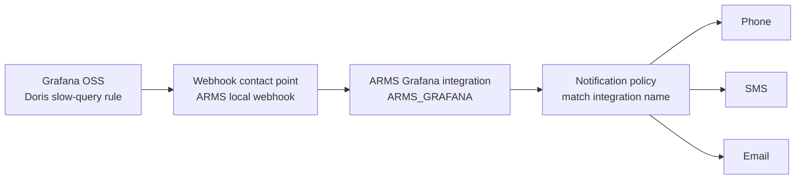
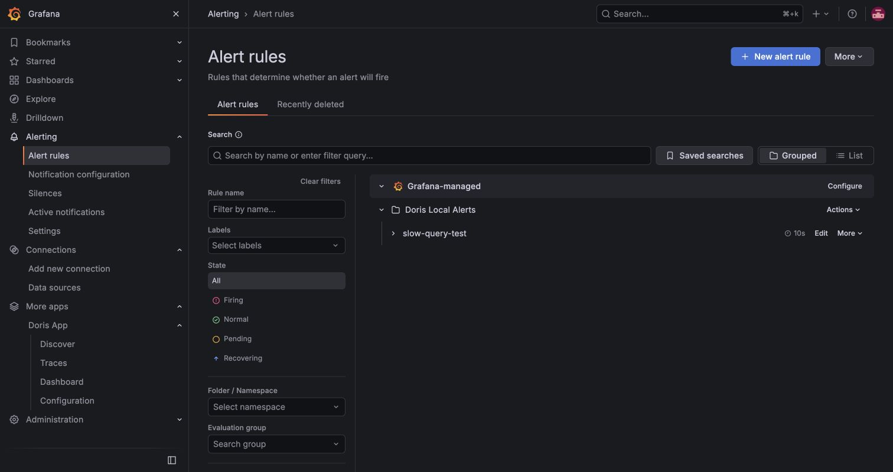
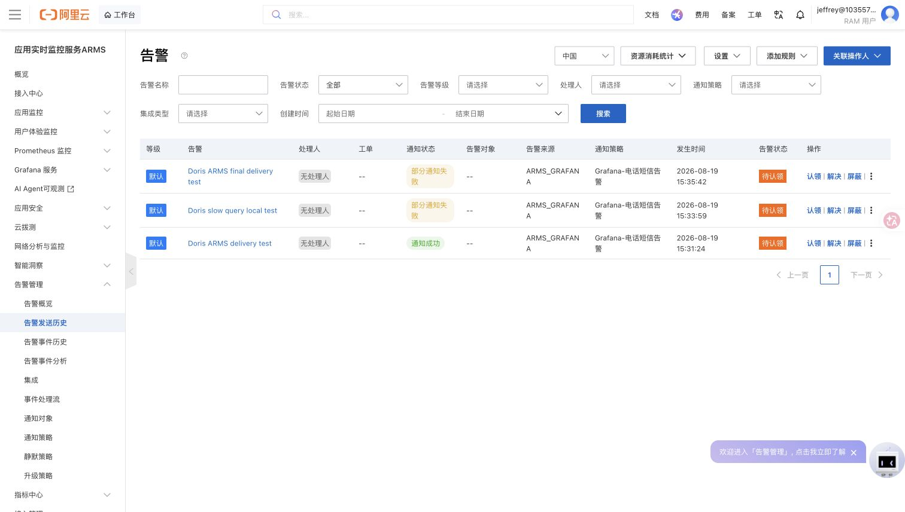

# 在开源 Grafana 中为 Doris 慢查询配置 ARMS 电话、短信与邮件告警

本文记录一条已经验证的本地链路：Grafana OSS 查询 Doris 的运行中 SQL，发现慢查询后推送给阿里云 ARMS，由 ARMS 按通知策略发送电话、短信和邮件。

> 安全说明：不要将 ARMS Grafana 集成 Webhook、Token、手机号或完整邮箱提交到仓库或放入截图。下文均使用匿名名称和占位描述。

## 最终结果

- 开源 Grafana：Grafana OSS `13.2.0`。
- 数据源：Doris App 提供的 MySQL 数据源。
- 规则：运行超过 **2 秒** 的非空闲 SQL 即进入告警状态；评估间隔为 **10 秒**，仅用于演示。生产环境应按 SLA 调高阈值和评估周期。
- 路由：Grafana Webhook → ARMS Grafana 集成 → `Grafana-电话短信告警` 通知策略 → 联系人 `Jeffrey`。
- 验证：电话和短信已实际收到；ARMS 发送历史显示真实慢查询事件已命中该策略。
- 邮件：策略中可以启用邮箱。如果 ARMS 显示“部分通知失败”，通常是邮箱尚未验证、邮件被拦截，或该通知对象未配置有效邮箱；电话/短信成功不代表邮件也成功。



## 1. 创建 Doris 慢查询告警规则

在 Grafana 中打开 **Alerting → Alert rules**，新建一个 Grafana-managed 规则。使用 Doris MySQL 数据源执行：

```sql
SELECT COUNT(*) AS value
FROM information_schema.processlist
WHERE TIME > 2
  AND COMMAND <> 'Sleep';
```

规则表达式使用 `Reduce` 取最后一个值，并配置阈值 **Is above 0**。在演示环境中设为每 10 秒评估、`Pending period = None`；生产中建议使用较高阈值（例如 60 秒或更高）和至少 1 分钟评估周期，避免对正常报表或批处理产生噪声。



给规则添加稳定标签，方便后续路由和排障：

```text
service=doris
environment=<your-environment>
severity=warning
```

## 2. 配置 Grafana OSS Webhook Contact point

在 **Alerting → Notification configuration → Contact points** 中创建 Webhook Contact point，例如 `ARMS local webhook`：

1. 类型选择 **Webhook**。
2. URL 填写 ARMS 的 Grafana 集成地址。该地址是敏感凭据，不要写进文档或截图。
3. 将该 Contact point 直接指定给慢查询规则，或在 Grafana Notification policy 中路由至它。

### 兼容 ARMS 的旧 Grafana 字段映射

本次 ARMS 集成原先使用旧 Grafana 事件格式（根节点为 `$.evalMatches`），而 Grafana 13 默认发送 Unified Alerting 格式（告警列表位于 `$.alerts`）。直接使用默认负载时，Grafana 的“Test notification sent successfully”只表示 HTTP 调用成功，ARMS 可能无法按旧映射形成可通知事件。

在 Grafana 12+ 的 Webhook **Custom Payload** 中配置一个兼容负载，将关键字段转换为 ARMS 现有映射可识别的格式：

```gotemplate
{{ coll.Dict
  "title" .CommonLabels.alertname
  "message" .CommonAnnotations.summary
  "state" .Status
  "ruleName" .CommonLabels.alertname
  "ruleUrl" (index .Alerts 0).GeneratorURL
  "@timestamp" (index .Alerts 0).StartsAt
  "evalMatches" (coll.Slice (coll.Dict
    "metric" .CommonLabels.alertname
    "value" "1"))
  | data.ToJSON }}
```

这个模板避免依赖表达式内部引用名（例如 `B`），使测试事件和真实慢查询事件都能被 ARMS 旧映射解析。

## 3. 配置 ARMS 集成与通知策略

在 ARMS 控制台中：

1. 进入 **告警管理 → 集成**，确认 Grafana 集成处于“启用 / 就绪”。
2. 进入集成编辑页，确认事件映射能从 `title` 取得告警名称、从 `message` 取得告警内容，并以 `evalMatches` 作为批处理根节点。
3. 在 **通知策略** 中编辑 `Grafana-电话短信告警`。
4. 使用以下精确匹配条件，而不要依赖托管 Grafana 才会附带的产品标签：

```text
_aliyun_arms_integration_name = ARMS_GRAFANA
```

5. 在 **通知对象** 页签中，为目标联系人启用电话、短信和邮箱；确认手机、邮箱已验证。

> 关键点：原来的 `_aliyun_arms_product_type = Grafana` 条件适用于特定托管 Grafana 事件。开源 Grafana 通过 Webhook 接入时，以 `_aliyun_arms_integration_name = ARMS_GRAFANA` 匹配更可靠，也能避免误匹配其他来源。

## 4. 端到端验证

可使用一条可控的测试 SQL 保持慢查询状态：

```sql
SELECT SLEEP(45) AS real_slow_query_delivery_test;
```

在该 SQL 运行期间，`information_schema.processlist` 中会出现满足条件的会话，Grafana 规则进入 Firing 并发送 Webhook。测试会真实触发电话、短信和邮件，请仅在低风险时间执行。

ARMS 的 **告警发送历史** 可作为最终判断依据：

- `告警来源` 应为 `ARMS_GRAFANA`。
- `通知策略` 应为 `Grafana-电话短信告警`。
- `通知状态` 为“通知成功”时，表示 ARMS 已成功提交到已启用的通知渠道。
- “部分通知失败”时，打开该记录检查具体渠道；本次验证中电话、短信已收到，邮件通道需要单独确认验证状态和收件箱拦截情况。



## 常见问题

### Grafana Test 显示成功，但手机没有收到

这只证明 Grafana 到 ARMS 的 HTTP 连通。请继续检查：

1. ARMS **告警事件历史**是否生成事件。
2. ARMS **告警发送历史**是否命中正确的通知策略。
3. 策略中的联系人是否勾选电话、短信或邮箱，且联系方式是否已验证。
4. 集成字段映射是否与 Grafana 的实际 Webhook Payload 版本一致。

### ARMS 显示“部分通知失败”

这意味着至少一种渠道失败。电话、短信、邮箱是独立投递的：检查发送记录的渠道级详情，并核对邮箱验证、垃圾邮件箱和企业邮箱反垃圾策略。

### 托管 SelectDB Grafana 测试超时

SelectDB 托管 Grafana 的 Webhook 出网与数据库白名单是两回事。数据库“数据安全”页面用于控制数据库入站访问，不能放行 Grafana 到 ARMS 的出网。若测试报 `context deadline exceeded`，需要由 SelectDB 服务侧确认其到 ARMS 域名的 HTTPS 出网能力；开源 Grafana 容器可直接访问时并不需要配置数据库白名单。

## 生产化建议

- 将 2 秒演示阈值调整为业务 SLA，例如 60 秒、5 分钟或按 SQL 类型分级。
- 使用 `severity`、`service`、`environment`、`team` 等标签做分级路由。
- 为 Webhook、通知策略和规则建立 provisioning 或 Terraform 配置，减少手工修改。
- 设定合理的重复通知和自动恢复时间，避免频繁电话告警。
- 将 ARMS Webhook 视为密钥；泄漏后立即在 ARMS 中轮换并同步更新 Grafana。
